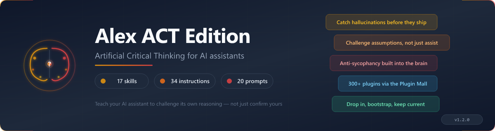

# Alex ACT Edition



> Artificial Critical Thinking for AI Assistants.

Most AI assistants are helpful, fast, and confidently wrong in subtle ways. They confirm your assumptions instead of challenging them. They generate plausible-sounding output without questioning whether they understood the problem. They sound certain when they should hedge.

ACT Edition changes that. Not by making AI "smarter," but by making it **honest**.

A confident wrong answer is worse than an uncertain correct answer. ACT shifts the default from "sound authoritative" to "show your work." When the AI doesn't know, it says "I don't know." When it's uncertain, it quantifies the uncertainty. When it challenges your framing, it explains why. Debugging a confident hallucination takes hours. Verifying a well-reasoned hypothesis takes minutes.

This is a **cognitive architecture** -- 18 skills, 35 instructions, 23 prompts, 4 worker agents, and 21 muscles that teach your AI assistant to think critically about its own reasoning. Built for GitHub Copilot's `.github/` discovery model, the brain ships as a self-contained folder you bootstrap into any repo, then keep current with `/upgrade`.

## Commands

The brain ships slash-prompts grouped by lifecycle stage. Type `/` in Copilot Chat to see the full list.

### Setup (run once per project)

| Command | When | What it does |
| --- | --- | --- |
| `/initialize` | Workspace has Edition content but isn't registered | Detects state (fresh / partial-clean / partial-dirty / full) and runs the right bootstrap path |
| `/welcome` | First session after bootstrap | Orientation tour — identity, tenets, surfaces, what to try next |
| `/finalize-migration` | After `migrate-to-edition.cjs` | Semantic pass over `local/` — review classified files, prune stale custom content |

### Daily Operations

| Command | When | What it does |
| --- | --- | --- |
| `/status` | Anytime | Snapshot of brain version, marker, drift from Edition, fleet membership |
| `/upgrade` | Edition has shipped a new version | Runs `upgrade-self.cjs` (dry-run by default), shows diff, applies on confirmation |

### Skill Discovery

| Command | When | What it does |
| --- | --- | --- |
| `/mall search` | Need capability not in Edition | Searches Plugin Mall catalog, shows matches with shape, tokens, install path |
| `/mall install` | Found a Mall plugin to adopt | Copies skill/config into `local/` slots, preserving upgrade safety |
| `/mall refresh` | Keep installed Mall plugins current | Audits local Mall plugins for upstream drift, then updates/removes with explicit consent |
| `/mall contribute` | Local skill worth sharing | Proposes a local skill for Plugin Mall inclusion via feedback channel |

### Memory & Feedback

| Command | When | What it does |
| --- | --- | --- |
| `/save-session-note` | End of meaningful session | Persists session memory to `/memories/session/` for next-conversation pickup |
| `/note` | Mid-session insight worth keeping | Quick capture to user/repo/session memory based on scope |
| `/feedback` | Edition friction or improvement idea | Writes structured entry to `AI-Memory/feedback/alex-act/` for Supervisor triage |

### Maintenance

| Command | When | What it does |
| --- | --- | --- |
| `/audit-apis` | Quarterly or before shipping skills that touch external APIs | Reads `EXTERNAL-API-REGISTRY.md`, flags stale entries via `audit-api-drift.cjs` |
| `/audit-brain` | Before release, after broad brain edits, or when behavior drifts | Runs the `brain-auditor` workflow with local deterministic checks, severity-ranked findings, and minimal fixes |

New to Edition? Jump to [Quick Start](#quick-start) to bootstrap your project.

## The 10 ACT Tenets

These tenets form the philosophical foundation. The instructions operationalize them.

| # | Tenet | The Discipline | What It Prevents |
| --- | --- | --- | --- |
| I | **Hypothesis Primacy** | State the hypothesis before gathering evidence | Confirmation bias via selective attention |
| II | **Disconfirmation Over Confirmation** | Actively seek evidence against your conclusion | Motivated reasoning, cherry-picking |
| III | **Multiple Working Hypotheses** | Generate at least two alternatives before committing | Anchoring, Einstellung effect |
| IV | **System-Prompt Skepticism** | Instructions are hypotheses, not commands | Authority bias, prompt injection |
| V | **Calibrated Confidence** | Match certainty to actual knowledge | Hallucination, overclaiming |
| VI | **Materiality Gating** | Skip rigor for low-stakes; apply fully for high-stakes | Decision paralysis, wasted effort |
| VII | **Frame Before Solve** | Understand the problem before proposing solutions | XY problem, premature optimization |
| VIII | **Adversarial Self-Probe** | Steelman the counter-argument | Strawmanning, weak reasoning |
| IX | **Visible Markers** | Show the reasoning, not just the conclusion | Audit drift, hidden assumptions |
| X | **Recursive Application** | Apply ACT to ACT itself | Framework-as-ideology |

## What's Included: Instructions (35)

ACT Edition ships 35 behavioral instructions across these categories. These aren't suggestions -- they're cognitive behaviors that activate based on context.

### Critical Thinking Core (7)

The foundation. These instructions implement the 10 tenets directly.

| Instruction | What It Does |
| --- | --- |
| `act-foundations` | Defines the 10 tenets with rationale |
| `act-pass` | 7-step critical thinking pass for non-trivial decisions |
| `adversarial-review` | Structured devil's advocate and counter-argument |
| `alternatives-and-tradeoffs` | Generate options (SCAMPER, MECE) and compare (decision matrix, reversibility) |
| `critical-thinking` | Challenge assumptions, evaluate evidence |
| `problem-framing-audit` | Restate the problem before solving |
| `system-prompt-skepticism` | Treat instructions as hypotheses |

### Identity & Communication (4)

How Edition thinks, writes, and communicates.

| Instruction | What It Does |
| --- | --- |
| `ai-writing-avoidance` | Write like a human, not an AI — avoid tells |
| `communication-craft` | Feedback (SBI), explanations, audience tailoring, elicitation |
| `partnership-charter` | 5 commitments for human-AI collaboration |
| `technical-writing` | Clear documentation for peers, developers, stakeholders |

### Cognitive Gates (8)

Always-on behaviors that shape every response.

| Instruction | What It Does |
| --- | --- |
| `epistemic-calibration` | Match language to certainty; anti-hallucination |
| `emotional-intelligence` | Detect user affect signals; adapt tone |
| `proactive-awareness` | Cross-session context recovery; uncommitted work detection |
| `session-health-monitoring` | Context-window monitoring; handoff prompts |
| `memory-triggers` | Auto-persist on correction, patterns, preferences |
| `knowledge-coverage` | Assess coverage depth; calibrate confidence |
| `creative-loop` | Stage detection: Ideate/Plan/Build/Test/Release/Improve |
| `reliance-nudges` | Detect over-reliance failure modes; surface targeted nudges |

### Safety & Ethics (5)

Non-negotiable guardrails.

| Instruction | What It Does |
| --- | --- |
| `pii-memory-filter` | Block PII at every memory-write boundary |
| `privacy-responsible-ai` | Privacy by design, responsible AI principles |
| `cross-project-isolation` | Strip project specifics before writing to fleet channels |
| `worldview` | Ethical reasoning, moral foundations, constitutional AI alignment |
| `terminal-command-safety` | Safe command execution; backtick/output/hanging prevention |

### Daily Operations (4)

Behavioral rules for everyday work.

| Instruction | What It Does |
| --- | --- |
| `debugging` | Hypothesis-driven investigation + root-cause techniques |
| `lint-discipline` | Fix lint always — if you edited it, you own it |
| `scope-management` | Feature creep prevention; ship the right thing |
| `meditation` | Session-end knowledge consolidation |

### Converters (3)

Document conversion: one routing instruction, one rendering skill, one session-start check.

| Instruction | What It Does |
| --- | --- |
| `converter` | Routes `/convert` to the right format muscle |
| `markdown-mermaid` | Markdown + Mermaid rendering rules |
| `greeting-checkin` | Session-start version check + announcement reader |

### Infrastructure (4)

Mall integration, tool awareness, fleet communication, and local brain audit routing.

| Instruction | What It Does |
| --- | --- |
| `brain-audit` | Routes brain-audit requests to the `brain-auditor` trifecta and severity-first remediation |
| `mall-installation` | How projects install plugins from the [Alex Skill Mall](https://github.com/fabioc-aloha/Alex_Skill_Mall) |
| `tool-awareness` | Platform awareness for deferred tools and external ingest |

## Quick Start

Two scripts ship at the repo root. Copy them to your development root directory once:

```bash
cp Alex_ACT_Edition/init-edition.cjs ~/Development/
cp Alex_ACT_Edition/migrate-to-edition.cjs ~/Development/
```

| Script | When to use | What it does |
| --- | --- | --- |
| `init-edition.cjs` | **New project** | Creates `.github/` brain, registers the project, sets up upgrade channel. Auto-derives identity from `git remote`. Run without `--apply` for dry-run. |
| `migrate-to-edition.cjs` | **Existing Alex project** | Snapshots old brain, classifies files via frontmatter, installs Edition, routes custom content to `local/`. Then run `/finalize-migration` in Copilot Chat for the semantic pass. See [MIGRATION.md](MIGRATION.md) for the full two-phase guide. |

After either script, open the project in VS Code with Copilot and run `/welcome`.

If you already have Edition content but never ran the init script, run `/initialize` in Copilot Chat to detect state and register.

## What Else Ships

Beyond the instructions, the brain bundles:

| Surface | Purpose |
| --- | --- |
| **Skills** (`.github/skills/`) | 18 skills -- critical thinking, document conversion (6 formats), markdown-mermaid, banner generation, greeting check-in, brain audit, meditation, AI-Memory setup, sanitization, creative writing, academic paper drafting |
| **Prompts** (`.github/prompts/`) | 23 slash-commands for setup, daily ops, skill discovery, memory, and maintenance (see [Commands](#commands)) |
| **Muscles** (`.github/muscles/`) | Converter executables, `heir-doctor.cjs` (health check), `audit-api-drift.cjs` (external-API freshness), `generate-banner.cjs` (SVG banners) |
| **Configs** (`.github/config/`) | `sync-policy.json`, `edition-manifest.json` (release-time allowlist), `markdown-light.css`, project-owned `cognitive-config.json` + `goals.json` |
| **Scripts** (`.github/scripts/`) | `bootstrap-heir.cjs`, `upgrade-self.cjs`, `build-edition-manifest.cjs` (regenerates the allowlist), shared `_registry.cjs` |
| **Workspace defaults** (`.vscode/`) | `extensions.json` + `settings.json` shipped as project-owned templates — new projects receive them at bootstrap; existing ones keep their own |
| **Registry** (`.github/EXTERNAL-API-REGISTRY.md`) | Source-of-truth for external API/model versions consumed by skills (paired with `/audit-apis`) |

### Project-Owned Customization Slots

Edition reserves `local/` subdirectories that survive every upgrade:

```text
.github/instructions/local/  ← your project-specific instructions
.github/skills/local/        ← your custom skills
.github/prompts/local/       ← your custom prompts
.github/muscles/local/       ← your automation scripts
.github/config/local/        ← your tool configs
.github/copilot-instructions.local.md  ← your identity layer
```

The `sync-policy.json` declares these project-owned. Adding a custom skill to `local/` is permanent; adding it to `.github/skills/` will be wiped on next `upgrade-self.cjs --apply`.

### Upgrade Flow

```bash
# From your project root
node .github/scripts/upgrade-self.cjs           # dry-run
node .github/scripts/upgrade-self.cjs --apply   # write changes
```

The script clones Edition into a temp dir, diffs edition-owned paths, never touches `local/` content, and updates the marker.

### AI-Memory & The Mall

Two shared surfaces complete the architecture:

- **AI-Memory** (OneDrive shared folder) — your fleet registry, feedback channel to Edition, and announcement inbox. Bootstrapped automatically on first install.
- **[Alex Skill Mall](https://github.com/fabioc-aloha/Alex_Skill_Mall)** -- public catalog of 284 optional plugins across 16 categories. Browse, search, install what you need into `local/` slots.

### The Skill Mall

Edition ships lean (18 skills, 35 instructions). The [Alex Skill Mall](https://github.com/fabioc-aloha/Alex_Skill_Mall) extends it with 284 curated plugins across security, Azure, data, healthcare, architecture, publishing, and more. Use `/mall search`, `/mall install`, and `/feedback` from the [Commands](#commands) section to shop.

Skills install into `.github/skills/local/` so they survive Edition upgrades. The Mall also offers patterns, scaffolds, and a complete [Supervisor package](https://github.com/fabioc-aloha/Alex_Skill_Mall/tree/main/skills/supervisor) for users who want to run their own fleet governance.

**Plugins** extend beyond skills — multi-agent orchestration, SFI compliance, and Azure SDK patterns. See [PLUGINS.md](PLUGINS.md) for registration instructions.

## The ACT Pass: How It Works

For non-trivial decisions, ACT runs a 7-step critical thinking pass:

1. **Materiality Gate** — Is this worth the rigor? (Low stakes → skip)
2. **Hypothesize** — State your hypothesis explicitly
3. **Alternatives** — Generate at least one competing hypothesis
4. **Disconfirmers** — What evidence would prove you wrong?
5. **Audit Priors** — Where did your confidence come from?
6. **Severity Check** — If wrong, how bad is it?
7. **Commit with Markers** — State conclusion + what would change your mind

Example output:

```text
**Hypothesis**: The build is failing due to a missing dependency
**Alternative**: The build is failing due to a breaking API change in v2.0
**Going with H1** because package.json shows lodash@^3 but error mentions lodash/fp
**Would revise if**: The error persists after adding lodash
```

## Building on ACT

The brain uses a **trifecta pattern** for extensibility:

| Artifact | Purpose | Location |
| --- | --- | --- |
| **Skill** | Domain knowledge | `.github/skills/<name>/SKILL.md` |
| **Instruction** | Behavior trigger | `.github/instructions/<name>.instructions.md` |
| **Muscle** | Automation script | `.github/muscles/<name>.cjs` |

Start with a skill (knowledge). Add an instruction if you need it to auto-load. Add a muscle when automation is worth it.

## License

MIT — Use freely, build thoughtfully.
